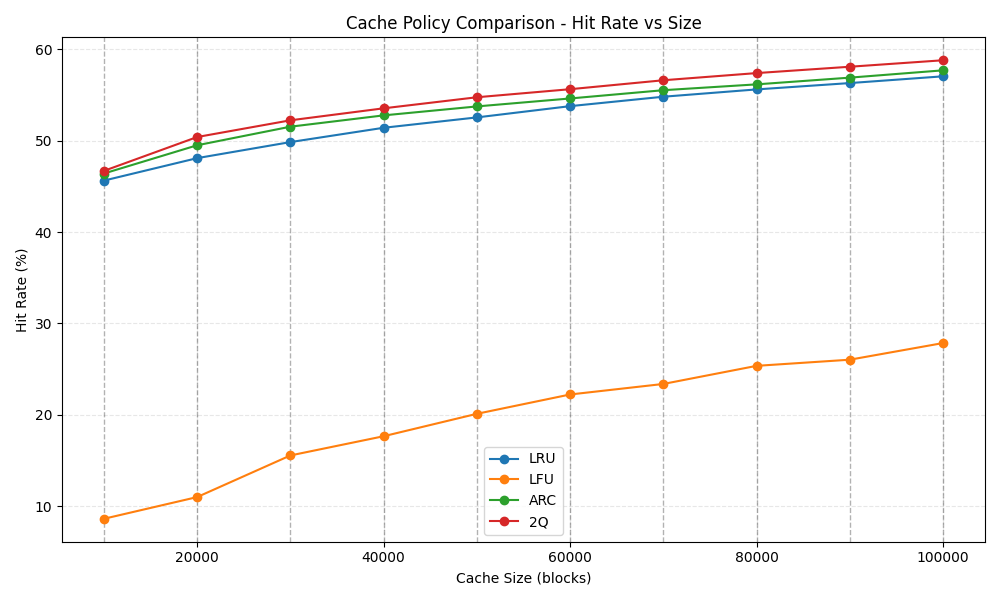

# Cache Replacement Policy Simulator (C++)

## 📌 Overview
This project is a custom C++ simulator built from scratch to evaluate and benchmark advanced cache replacement algorithms. It moves beyond standard implementations by testing these policies against massive, real-world disk I/O traces and actively attacking them with custom adversarial workloads.

The architecture strictly adheres to Object-Oriented Programming (OOP) principles. All algorithms inherit from a base `CachePolicy` virtual class, allowing a single polymorphic orchestrator to swap policies dynamically during simulation.

---

## 📊 Benchmarking & Dataset

* **Dataset Source:** Benchmarks are run against public UMass IoTrace disk access traces available in the [UMass Storage Repository](https://traces.cs.umass.edu/docs/traces/storage/). The raw `.spc.bz2` files, such as [Financial1.spc.bz2](https://skulddata.cs.umass.edu/traces/storage/Financial1.spc.bz2), are converted into packed binary format using a custom `parse-traces.py` script for high-performance reading in C++.

### Simulation Results (`Financial1.spc.bz2` with 50,000 blocks)

> **The Conclusion:** Advanced algorithms that utilize ghost lists and probationary queues (ARC, 2Q) successfully filtered out sequential scan pollution, achieving higher hit rates than standard recency (LRU) or frequency (LFU) approaches.

| Cache Policy | Hit Rate | Cache Hits | Cache Misses | Total Accesses |
| :--- | :--- | :--- | :--- | :--- |
| **2Q (Two Queue)** | 54.76% | 19,777,707 | 16,337,510 | 36,115,217 |
| **ARC (Adaptive)** | 53.75% | 19,415,103 | 16,700,114 | 36,115,217 |
| **LRU** | 52.55% | 18,980,762 | 17,134,455 | 36,115,217 |
| **LFU** | 20.10% | 7,259,598 | 28,855,619 | 36,115,217 |

### Cache Size Scaling


---

## Implemented Algorithms (O(1) Time Complexity)
Every policy is implemented with a strict focus on optimal time and space complexity, utilizing advanced combinations of Standard Template Library (STL) structures.

* **LRU (Least Recently Used)**
  * **Structures:** `std::list` + `std::unordered_map`
  * **Mechanic:** Classic doubly-linked list for recency tracking.
* **LFU (Least Frequently Used)**
  * **Structures:** Doubly-Linked List of frequency buckets + `key->freq` map + `key->node` map.
  * **Mechanic:** Maintains true O(1) runtime by tracking a `min_freq` pointer and shifting keys between dynamic buckets.
* **ARC (Adaptive Replacement Cache)**
  * **Structures:** Four `std::list` queues (`T1`, `T2`, `B1`, `B2`) + Custom Enum State Map.
  * **Mechanic:** Uses "ghost lists" (`B1`, `B2`) to track recently evicted keys. Dynamically tunes an adaptive parameter *p* to balance between recency and frequency based on workload behavior.
* **2Q (Two Queue)**
  * **Structures:** `A1_in` (Probationary FIFO) + `A1_out` (Ghost FIFO) + `A_m` (Main LRU).
  * **Mechanic:** Protects the main cache from sequential scan pollution by forcing blocks to "prove their worth" in a probationary queue before promotion.

---

## 🛠️ Engineering Challenges & Learnings
Building a simulator from the ground up exposed several deep architectural and algorithmic challenges:

### 1. Data Serialization & C++ Struct Padding
* **The Bug:** Initial binary traces parsed by Python were generating corrupted, astronomically large disk addresses when read into C++.
* **The Fix:** Identified a C++ compiler memory alignment mismatch. Wrapped the trace struct in `#pragma pack(push, 1)` to disable default byte padding, ensuring the C++ struct perfectly matched the densely packed binary output from Python.

### 2. 2Q Memory Under-Utilization
* **The Bug:** The standard textbook implementation of 2Q strictly partitions capacity between `A1_in` and `A_m`. During testing, if a workload lacked recurring accesses, `A_m` remained empty, wasting up to 75% of the allocated RAM.
* **The Fix:** Refactored the eviction logic to use a global capacity check:
  $$|A1_{\text{in}}| + |A_m| \le C$$
  Pages are now only evicted when the total physical cache limit is breached, allowing `A1_in` to gracefully utilize 100% of memory if needed.

### 3. Cache Mechanics in Ghost Lists
* **The Bug:** During scan-resistance adversarial tests, ARC and 2Q reported 0% hit rates because items in "ghost lists" were never being promoted.
* **The Fix:** Realized a cache `get` on a ghost list must return a miss (because the data isn't in RAM). In real systems, the client then fetches from disk and issues a `put`. Updated the test harness to explicitly issue a `put(key, val)` after a ghost miss, accurately simulating real disk-reload behavior and triggering the expected algorithmic promotions.

---

## Adversarial Testing Suite
Instead of relying solely on generic disk traces, the `tests/` directory contains mathematical workloads designed to break specific algorithms:

* **LRU Sequential Thrashing Test:** A loop that requests $N+1$ items in a cache of size $N$.
  * *Result:* LRU achieves 0%. 2Q successfully achieves 56% by filtering the scan.
* **LFU Frequency Shock Test:** A workload that heavily requests one set of items, then abruptly shifts to a completely new set.
  * *Result:* LFU achieves 0% on the new phase due to "cache pollution." ARC dynamically adapts to achieve 100%.

---

## How to Run

### 1. Parse the Trace Dataset
Convert the raw Financial1.spc.bz2 (UMass trace) into an optimized binary format:
```bash
python3 parse-traces.py [trace file path] [output binary file path]
python3 parse-traces.py Financial1.spc.bz2 Financial1.bin
```

### 2. Compile and Run the Main Simulator
The project relies on standard C++17 with no external dependencies.
```bash
g++ -O3 main.cpp -o cache_sim
./cache_sim Financial1.bin
```

### 3. Plot Results
```bash
python plot-results.py
```

### 4. Compile and Run the Adversarial Tests
The edge-case analysis and logic verification tests are isolated in the tests/ directory.

```bash
g++ -O3 tests/sequential-thrashing.cpp -o seq && ./seq
g++ -O3 tests/frequency-shock.cpp -o freq && ./freq
g++ -O3 tests/shifting-hybrid.cpp -o hybrid && ./hybrid
g++ -O3 tests/scan-resistance.cpp -o scan && ./scan
```
